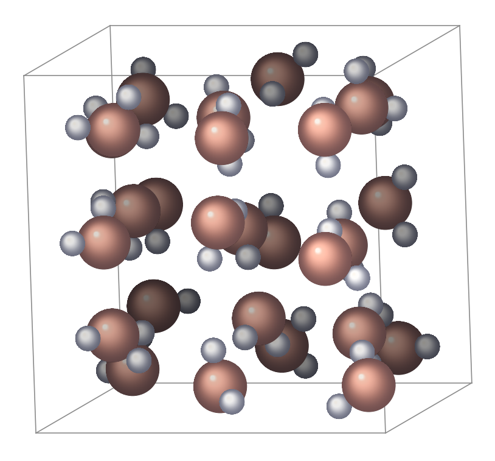
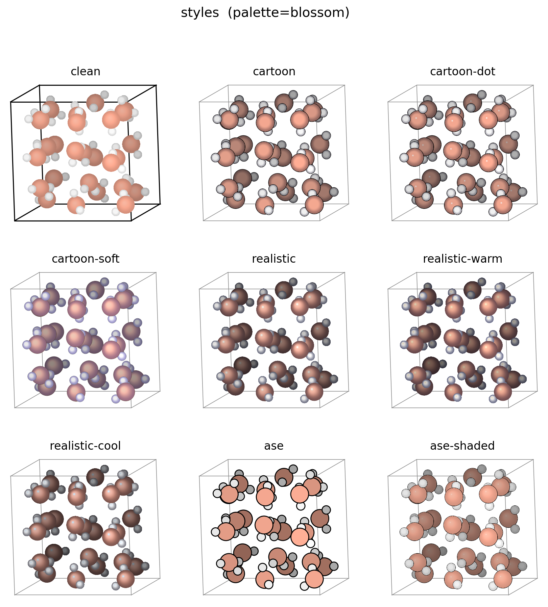
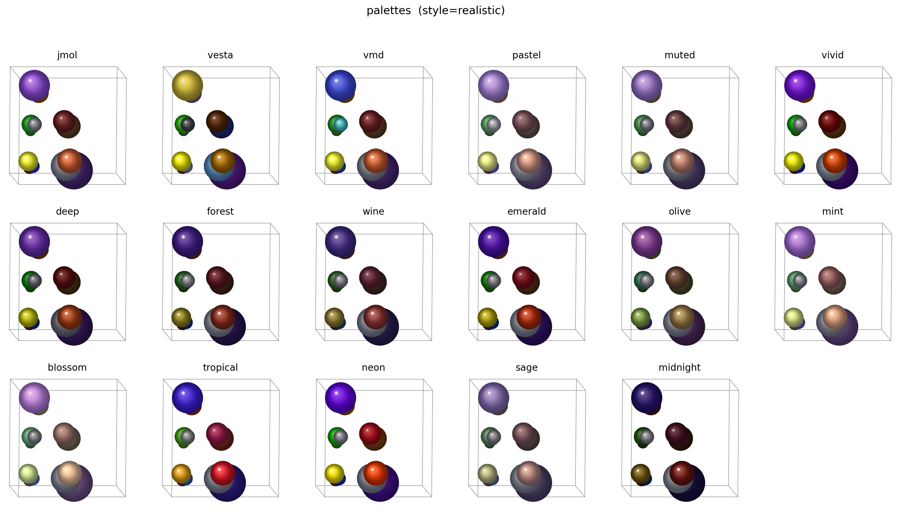
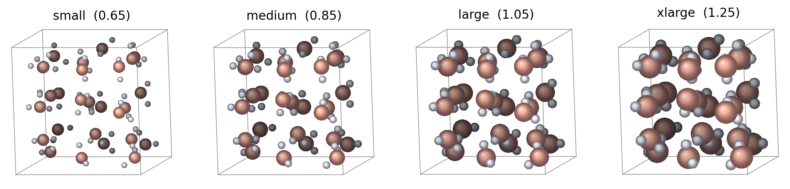

# crystalvase

Tool for generating true **vector** figures of [ASE](https://wiki.fysik.dtu.dk/ase/) structures with
matplotlib — no POV-Ray.



*(the very same figure as true vector: [docs/preview.pdf](docs/preview.pdf))*

## Install

```bash
pip install -e .              # core; add [vesta] for the VESTA palette, [raster] for JPG/TIFF
```

## Use

```python
from ase.io import read
import crystalvase as cv

atoms = read("POSCAR")
cv.write(atoms, "struct.pdf")                                 # defaults (below)
cv.write(atoms, "struct.jpg", rotation="45x,10y,0z", style="cartoon", dpi=300)
cv.render(atoms, ax)                                          # or draw onto your own Axes
```

```bash
crystalvase POSCAR out.pdf
crystalvase traj.xyz out.png --index ::10 --style cartoon     # slice -> one file per frame
```

Defaults: palette `blossom`, style `realistic`, size `large`, near-face-on view.
Format is taken from the extension. Main options (API kwargs = CLI flags): `rotation`
(ASE `"<a>x,<b>y,<c>z"` syntax), `palette`, `style`, `radius_scale` (`"small"` /
`"medium"` / `"large"` / `"xlarge"` or a number), `show_cell`, `reduce_cell`, `rings`
(gradient rings per sphere, default 220 — fewer gives much smaller vector files, e.g.
`rings=40` for many-panel figures), plus `figsize`/`dpi`/`background` for saving.

## Palettes & styles

- **Palettes:** `jmol` (ASE default), `vesta`, `vmd`; tone variants of the ASE colours
  (`pastel`, `muted`, `vivid`, `deep`); and tone schemes where every element keeps its
  hue family but converges on a common tone (the way forest/mint/olive/neon are all
  greens) — `forest`, `wine`, `emerald`, `olive`, `mint`, `blossom` (**default**),
  `tropical`, `neon`, `sage`, `midnight`. Roll your own with `cv.adjust(...)`
  (multiplicative tweaks) or `cv.retone("jmol", hue=..., sat=..., value=...)` (pull towards a tone).
- **Styles** (shading only), all depth-shaded so structure stays clear:
  `clean` — bright matte spheres, no outline, black cell box (MD-snapshot look);
  `cartoon` — flat "sticker" discs shaded at the edges, outlined (`cartoon-dot` adds a
  gloss dot, `cartoon-soft` is smooth matte pastel);
  `realistic` — studio-lit gloss, the default (`realistic-warm`, `realistic-cool`);
  `ase` — classic flat ASE look, outlined + depth-dimmed (`ase-shaded`).
  Custom: `cv.make_style(edge_dark=0.6, hot_amt=1.0, ...)` — see `styles.py`.

`crystalvase --list-palettes` / `--list-styles` print the choices; `examples/` compares
them. Run the tests with `pytest`. MIT licensed.

## Reference galleries

Pick a `style`, `palette` and `radius_scale` by eye. Regenerate with
`python docs/make_gallery.py` (self-contained — builds its own demo structures).

**Styles** (default palette):



**Palettes** (default style):



**Sizes** (`radius_scale`):


